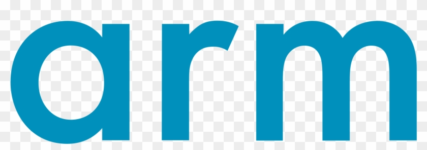
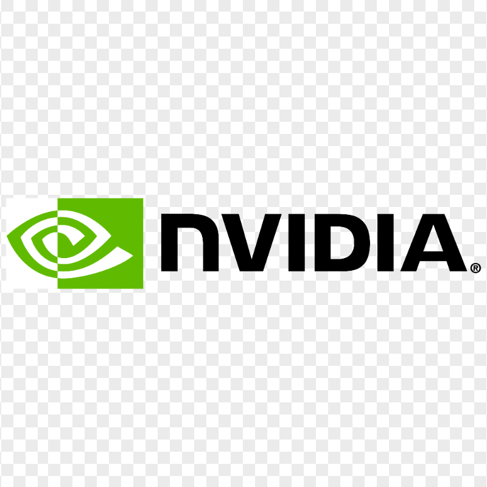
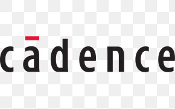
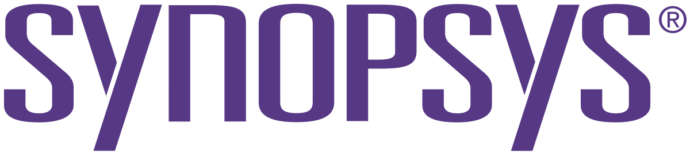
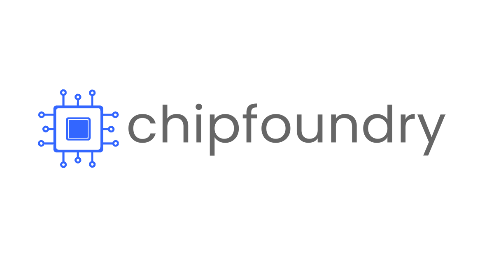
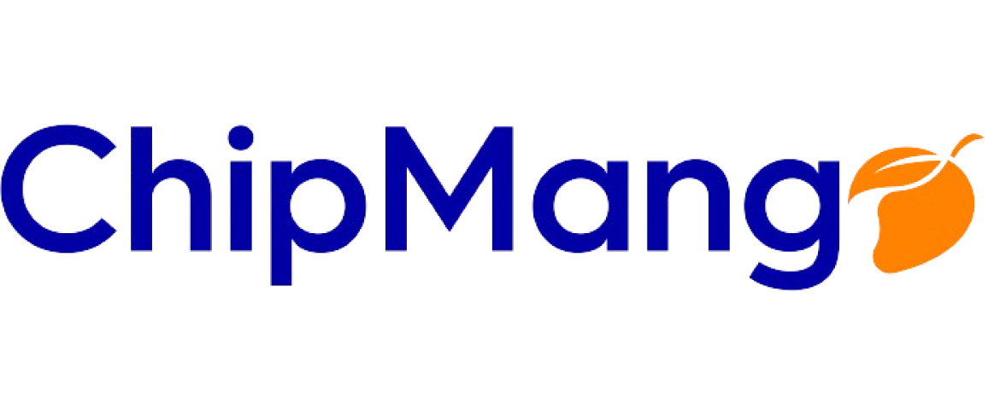

# AI Hardware Design League (AI-HDL) 2025-2026

<div align="center">


[](https://creativecommons.org/licenses/by-nc/4.0/)
[](https://discord.gg/your-discord-link)

**Empowering the Next Generation of Hardware Designers with AI**

</div>

---

## 🚀 Welcome to AI-HDL 2025-2026!

The **AI Hardware Design League (AI-HDL)** is an innovative educational competition that combines the power of **Artificial Intelligence** with **Hardware Design**. Students from around the world collaborate in teams to design cutting-edge hardware using Large Language Models (LLMs) and modern EDA tools.

> **No prior hardware design experience required!** 🎯

**🎓 Inspired by**: The pioneering work of the [University of Arizona AI-HDL program](https://csm.arizona.edu/AIHDL), which has successfully demonstrated the power of AI-assisted hardware design education with winners like "AI or Die" from University of Arizona and international teams from Vietnam, Germany, and India.

📖 **[Learn more about the connection to the official AI-HDL program →](./docs/about-aihdl.md)**

### 🎬 Watch Our Introduction Video
*[Link to introduction video will be added]*

---

## 🏆 Previous Winners (2024-2025)

### **🥇 Best Design Overall**
**AI or Die** - *The University of Arizona*

### **🎓 Lower Division (Community College & Undergraduate)**
1. **AI or Die** - *The University of Arizona*
2. **UET2** - *VNU University of Engineering and Technology* ⭐ *Most Secure Design*
2. **DigiDynamos** - *Hanoi University of Science and Technology* ⚡ *Best Energy-Efficient Design*
3. **CC-1** - *Pima Community College* 📐 *Best Area-Efficient Design*

### **🎓 Upper Division (Graduate Teams)**
1. **UHD CAT** - *University of Heidelberg*
2. **UET1** - *VNU University of Engineering and Technology*
2. **UET3** - *VNU University of Engineering and Technology*
3. **ChipX** - *The University of Arizona*

---

## 📅 Timeline 2025-2026

| Date | Event |
|------|--------|
| **September 2025** | Registration Opens |
| **December 2025** | Registration Closes |
| **October 7-9 2025** | League Kickoff Event (@ SEMICON West, Pheonix, AZ) |
| **October  2025** | Friendlies (Webinar) #1 Released |
| **November  2025** | Friendlies (Webinar) #2 Released |
| **December  2025** | Friendlies (Webinar) #3 Released |
| **January  2026** | Group Stage - Design Problem #1 Released |
| **February  2026** | Playoffs - Design Problem #3 |
| **March  2026** |Playoffs - Design Problem #2 |
| **April  2026** | Finals – Virtual workshop for FPGA to ASIC Tapeout design |
| **May 2026** | Final Submission and Design Sign-off|
| **July 25 - 29, 2026** | Awards Ceremony (@ 63rd DAC 2026 - Design Automation Conference, Long Beach, CA) |

---

## 🎯 What You'll Learn

### 🤖 **AI-Powered Design**
- Master prompting techniques for hardware design with LLMs
- Learn to use ChatGPT, Claude, and other AI tools for Verilog generation
- Understand AI-assisted verification and optimization

### 🔧 **Hardware Design Fundamentals**
- Verilog HDL programming
- Digital logic design principles
- FPGA implementation and testing
- Hardware simulation and synthesis

### 🛡️ **Hardware Security & Optimization**
- Power and area optimization techniques
- Security considerations in hardware design
- Performance analysis and benchmarking

### 🏭 **Industry Tools & Practices**
- Professional EDA tool workflows
- Design documentation and version control
- Team collaboration in hardware projects

---

## 🏗️ Competition Structure

### **Team Formation**
- **Team Size**: 3-4 students
- **Divisions**: 
  - Lower Division (Community College & Undergraduate)
  - Upper Division (Graduate)
- **Registration**: Individual or pre-formed teams welcome

### **Design Process**
1. **AI-Generated Design**: Use LLMs to generate Verilog code
2. **Verification**: Test with provided and custom test benches  
3. **FPGA Implementation**: Deploy on real hardware with mentor guidance
4. **Documentation**: Maintain detailed design logs and AI interaction records

### **Weekly Commitment**
- **Mentor Meetings**: 1-2 hours/week
- **Project Work**: 5-10 hours/week
- **Flexible scheduling** based on team availability

---

## 🏅 Judging & Awards

### **Evaluation Criteria**
- **Functionality** (40%): Does the design work as specified?
- **AI Integration** (25%): Effective use of AI tools and techniques
- **Innovation** (20%): Creative solutions and novel approaches  
- **Documentation** (15%): Quality of design logs and AI interaction records

### **Special Awards**
- 🛡️ **Most Secure Design**
- ⚡ **Best Energy-Efficient Design** 
- 📐 **Best Area-Efficient Design**
- 🎨 **Most Creative AI Usage**
- 👥 **Best Team Collaboration**

### **Prizes**
- Hardware prizes and FPGA development boards
- Internship opportunities with sponsor companies
- Recognition at major conferences
- Certificates and trophies

---

<!-- ## 🎓 Eligibility & Registration

### **Who Can Participate?**
Students from the following partner institutions:

#### **🇺🇸 United States**
- University of Arizona
- Pima Community College  
- Pasadena City College

#### **🇦🇺 Australia**
- University of New South Wales

#### **🇻🇳 Vietnam**
- Hanoi University of Science and Technology
- VNU University of Engineering and Technology

#### **🇮🇳 India**
- Digital University of Kerala

#### **🇩🇪 Germany**
- University of Heidelberg

### **Want to Join from Another Institution?**
We're expanding! [Sign up here](https://forms.gle/your-expansion-form) to be notified when we add new partner universities.

### **Registration Process**
1. Visit our [Registration Portal](https://forms.gle/your-registration-form)
2. Choose individual or team registration
3. Complete eligibility verification
4. Receive welcome packet and Discord access

**Registration is FREE!** 🎉 -->

---

## 🛠️ Tools & Resources

### **AI Tools Provided**
- Access to premium LLM APIs (ChatGPT, Claude, etc.)
- Custom hardware design prompting guides
- AI interaction logging tools

### **Hardware Design Tools**
- **Simulation**: ModelSim, Icarus Verilog
- **Synthesis**: Yosys, Vivado
- **FPGA**: Xilinx and Intel FPGA toolchains
- **Verification**: Formal verification tools

### **Development Environment**
We provide comprehensive setup guides for local tool installation:

- **Simulation**: Icarus Verilog, GTKWave
- **Synthesis**: Yosys (open-source)
- **AI Integration**: Python with OpenAI/Anthropic APIs
- **Platform Support**: Windows, macOS, Linux

See our [Getting Started Guide](./docs/getting-started/README.md) for detailed installation instructions.

---

## 📚 Educational Resources

### **Getting Started**
- [Introduction to Digital Design](./docs/intro-to-digital-design.md)
- [AI for Hardware Design Guide](./docs/ai-hardware-guide.md)
- [Verilog Crash Course](./docs/verilog-crash-course.md)

### **Video Tutorials**
- [What is an FPGA?](https://example.com/fpga-intro)
- [Using ChatGPT for Verilog](https://example.com/chatgpt-verilog)
- [Hardware Security Basics](https://example.com/hw-security)

### **Industry Insights**
- [ARM Education Resources](https://www.arm.com/resources/education)
- [Semiconductor Career Paths](./docs/career-paths.md)
- [Latest Industry Trends](./docs/industry-trends.md)

---

## **SPONSORSHIP**

<div style="background-color: #f5f5f5; padding: 20px; border-radius: 8px; margin: 20px 0;">

### **AI-HDL Sponsors**

<!-- University of Arizona - Centered at top -->
<div style="text-align: center; margin-bottom: 30px;">

</div>

<!-- Main sponsors grid - 2x2 layout -->
<div style="display: grid; grid-template-columns: 1fr 1fr; gap: 30px 40px; align-items: center; justify-items: center; margin-bottom: 30px;">

<div style="text-align: center; display: flex; align-items: center; justify-content: center; height: 100px;">

</div>

<div style="text-align: center; display: flex; align-items: center; justify-content: center; height: 100px;">

</div>

<div style="text-align: center; display: flex; align-items: center; justify-content: center; height: 100px;">

</div>

<div style="text-align: center; display: flex; align-items: center; justify-content: center; height: 100px;">

</div>

</div>

<!-- Bottom row - Foundry partners -->
<div style="display: grid; grid-template-columns: 1fr 1fr; gap: 30px 40px; align-items: center; justify-items: center;">

<div style="text-align: center; display: flex; align-items: center; justify-content: center; height: 80px;">

</div>

<div style="text-align: center; display: flex; align-items: center; justify-content: center; height: 80px;">

</div>

</div>

</div>

### **Academic Partners**
University of Arizona • University of New South Wales • Hanoi University of Science and Technology • VNU University of Engineering and Technology • Digital University of Kerala • University of Heidelberg

### **Become a Sponsor**
Interested in supporting the next generation of hardware designers? 

**Current sponsors provide:**
- **EDA Tools & Software Licenses** (Synopsys, Cadence)
- **Hardware & AI Acceleration** (NVIDIA, AMD)
- **Educational Resources & Mentorship** (ARM)
- **Research Funding & Grants** (NSF)
- **Manufacturing & Tapeout Opportunities** (Foundry Partners)

[Learn about sponsorship opportunities](./docs/sponsorship.md)

---

## 📁 Repository Structure

```
AIHDL-2025-2026/
├── challenges/                 # Competition challenges
│   ├── challenge-1/           # First challenge materials
│   ├── challenge-2/           # Second challenge materials
│   └── challenge-3/           # Third challenge materials
├── docs/                      # Documentation and guides
│   ├── getting-started/       # Beginner tutorials
│   ├── ai-guides/            # AI tool usage guides
│   └── resources/            # Additional learning materials
├── examples/                  # Sample designs and templates
├── tools/                     # Utility scripts and tools
└── submissions/              # Template for team submissions
```

---

## 🤝 Community & Support

### **Get Help**
- 💬 **Discord**: Join our active community for real-time help
- 📧 **Email**: aihdl-support@arizona.edu
- 📋 **Office Hours**: Weekly virtual sessions with mentors
- 🐛 **Issues**: Report problems via GitHub Issues

### **Stay Connected**
- 🌐 **Official AI-HDL Website**: [csm.arizona.edu/AIHDL](https://csm.arizona.edu/AIHDL)
- 🎓 **University of Arizona**: [Center for Semiconductor Manufacturing](https://csm.arizona.edu/)
- 📧 **Contact**: aihdl-support@arizona.edu
- 💬 **Discord**: [Join our community](https://discord.gg/your-discord-link)

---

## 📄 License & Usage

This work is licensed under a [Creative Commons Attribution-NonCommercial 4.0 International License](https://creativecommons.org/licenses/by-nc/4.0/).

**What this means:**
- ✅ You can share and adapt the materials
- ✅ Perfect for educational use
- ❌ Commercial use requires permission
- 📝 Attribution required

---

## 🙏 Acknowledgments

This repository is inspired by and builds upon the excellent work of the [University of Arizona AI Hardware Design League](https://csm.arizona.edu/AIHDL). Special thanks to:

- **University of Arizona** [Center for Semiconductor Manufacturing](https://csm.arizona.edu/) and the AI-HDL organizing team
- **Dr. Soheil Salehi** and the AI-HDL leadership team for pioneering AI-assisted hardware design education
- **Major Industry Sponsors**: Synopsys, Cadence, NVIDIA, ARM, AMD, NSF, and foundry partners
- All participating universities and their dedicated faculty
- The open-source hardware and AI communities
- Student participants who drive innovation forward

**Note**: This repository provides a framework for organizing similar competitions. For the official University of Arizona AI-HDL program, visit [csm.arizona.edu/AIHDL](https://csm.arizona.edu/AIHDL).

---

<div align="center">

**Ready to design the future?** 🚀

[**REGISTER NOW**](https://forms.gle/your-registration-form) | [**Join Discord**](https://discord.gg/your-discord) | [**Learn More**](https://csm.arizona.edu/AIHDL)

*Building tomorrow's chips with today's AI* ⚡

</div>
