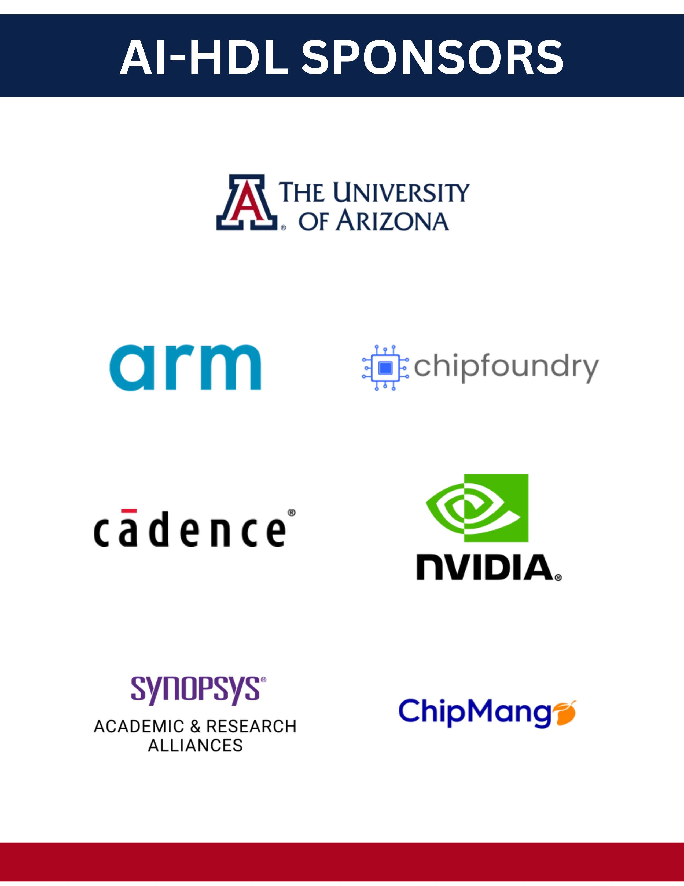

# AI Hardware Design League (AI-HDL) 2026

<div align="center">

[](https://csm.arizona.edu/AIHDL)
[](https://creativecommons.org/licenses/by-nc/4.0/)
[](https://discord.com/invite/dFXMvX6cNG)

**Empowering the Next Generation of Hardware Designers with AI**

</div>

---

## 🚀 Welcome to AI-HDL 2026!

The **AI Hardware Design League (AI-HDL)** is an innovative educational competition that combines the power of **Artificial Intelligence** with **Hardware Design**. Students from around the world collaborate in teams to design cutting-edge hardware using Large Language Models (LLMs) and modern EDA tools.

> **No prior hardware design experience required!** 🎯

**🎓 Inspired by**: The pioneering work of the [University of Arizona AI-HDL program](https://csm.arizona.edu/AIHDL), which has successfully demonstrated the power of AI-assisted hardware design education with winners like "AI or Die" from University of Arizona and international teams from Vietnam, Germany, and India.

📖 **[Learn more about the connection to the official AI-HDL program →](./docs/about-aihdl.md)**

### 🎬 Watch Our Introduction Video

[[AI-HDL Introduction Video part 1]](https://www.youtube.com/watch?v=TVYUB6AjqxA)
[[AI-HDL Introduction Video part 2]](https://www.youtube.com/watch?v=HUBlg8Xvp3Q)

---

## 🏆 Previous Winners (2025)

### **🥇 Best Design Overall**

**AI or Die** - *The University of Arizona*

### **🎓 Lower Division (Community College & Undergraduate)**

1. **AI or Die** - *The University of Arizona*
2. **UET2** - *VNU University of Engineering and Technology* ⭐ *Most Secure Design*
3. **DigiDynamos** - *Hanoi University of Science and Technology* ⚡ *Best Energy-Efficient Design*
4. **CC-1** - *Pima Community College* 📐 *Best Area-Efficient Design*

### **🎓 Upper Division (Graduate Teams)**

1. **UHD CAT** - *University of Heidelberg*
2. **UET1** - *VNU University of Engineering and Technology*
3. **UET3** - *VNU University of Engineering and Technology*
4. **ChipX** - *The University of Arizona*

---

## 📅 Timeline 2025-2026

| Date                        | Event                                                                              |
| --------------------------- | ---------------------------------------------------------------------------------- |
| **September 22 2025** | Registration Opens                                                                 |
| **October 7-9 2025**  | League Kickoff Event (@ SEMICON West, Pheonix, AZ)                                 |
| **October 23  2025**  | Friendlies (Webinar) #1 Released                                                   |
| **November 20 2025**  | Friendlies (Webinar) #2 Released                                                   |
| **December 18 2025**  | Friendlies (Webinar) #3 Released                                                   |
| **December 19 2025**  | Registration Closes                                                                |
| **January 15 2026**   | League Starts with Design Phase #1 AI generated Verilog Synthesis and verification |
| **January 29 2026**   | Milestone Review and Office Hours #1                                               |
| **February 12 2026**  | Design Phase #2 AI Driven PPA Optimization                                         |
| **February 26 2026**  | Milestone Review and Office Hours #2                                               |
| **March 12 2026**     | Design Phase #3 Secure Implementation and Design Optimization                      |
| **March 26 2026**     | Milestone Review and Office Hours #3                                               |
| **April 1 2026**      | Finals – Design Phase #4 Final Design Tape-out Preparation                        |
| **April 23 2026**     | Milestone Review and Office Hours #4                                               |
| **May 1 2026**        | League Ends with Final Submission and Design Sign-off                              |
| **May 14 2026**       | Winner Announcement                                                                |

---

## 🎯 What You'll Learn

### 🤖 **AI-Powered Design**

- Master prompting techniques for hardware design with LLMs
- Learn to use ChatGPT, Claude, and other AI tools for Verilog generation
- Understand AI-assisted verification and optimization

### 🔧 **Hardware Design Fundamentals**

- Verilog HDL simulation and synthesis
- FPGA implementation and testing
- Hardware Chip Tapeout: Full RTL-GDSII Flow

### 🛡️ **Hardware Security & Optimization**

- Power and area optimization techniques
- Security considerations in hardware design
- Performance analysis and benchmarking

### 🏭 **Industry Tools & Practices**

- Professional EDA tool workflows
- Design documentation and version control
- Team collaboration in hardware projects

---

## Understand the challenge

- In this competition, your team will be given a specific hardware design problem to solve. The challenge is to develop an HDL solution with the help of AI. This means you’ll use AI tools (such as ChatGPT or other code-generating models) to write and improve your Verilog/VHDL code. You might prompt the AI to generate a module, debug errors, or suggest optimizations. Part of the challenge is learning how to ask the right questions and refine AI outputs to get correct, efficient hardware designs.
- The project will be structured in phases with milestones. You will start with an initial design phase, then iteratively refine your hardware based on performance and security requirements. At each milestone, you’ll verify your design against the provided test benches to ensure correctness. Mentors will conduct design reviews, giving feedback and guidance. Expect to learn about hardware fundamentals, simulation tools, and best practices in chip design along the way. By the final phase, your team should have a fully working design meeting the challenge specifications.
- **What to expect:** It’s a hands-on learning experience. You’ll attend workshops/webinars (see Workshop & Resources below) on topics like using AI in hardware design, how to run simulations, and more. You’ll also document your progress, keeping track of your AI prompts, design decisions, and test results. In the end, teams will present their designs, share their approach, and demonstrate how AI contributed. This challenge is not just about getting a working chip design, but also about exploring creative AI-driven solutions and learning from the process. Embrace the experimentation, and enjoy the ride!

---

## 🏗️ Competition Structure

### **Team Formation**

- **Team Size**: 3-4 students
- **Divisions**:
  - Lower Division (Community College & Undergraduate)
  - Upper Division (Graduate)
- **Registration**: Individual or pre-formed teams welcome

### **Design Phases (DP)**

1. **DP1: Additional Module Synthesis**: Use LLMs to generate Verilog code and synthesize RTL Netlist + Baseline Synthesis Report, test with provided and custom test benches.
2. **DP2: PPA Optimization**: Use LLMs to perform timing, power, and area optimization.
3. **DP3: Security & Vulnerability Optimization**: Assess vulnerabilities (side-channels, debug misuse, hardware Trojans) and use LLM to implement countermeasures.
4. **DP4: RTL to GDSII & Tapeout**: Teams complete floorplanning, place-and-route, sign-off (DRC/LVS/STA), and prepare tape-out deliverables.

### **Weekly Commitment**

- **Mentor Meetings**: 1-2 hours/week
- **Project Work**: 5-10 hours/week
- **Flexible scheduling** based on team availability

---

## 🏅 Judging & Awards

### **Evaluation Criteria**

- **Functionality** (40%): Does the design work as specified?
- **AI Integration** (25%): Effective use of AI tools and techniques
- **Innovation** (20%): Creative solutions and novel approaches
- **Documentation** (15%): Quality of design logs and AI interaction records

### **Special Awards**

- 🛡️ **Most Secure Design**
- ⚡ **Best Energy-Efficient Design**
- 📐 **Best Area-Efficient Design**
- 🎨 **Most Creative AI Usage**
- 👥 **Best Team Collaboration**

### **Prizes**

- Chip Tapeout for Top 3 Winners.
- Hardware prizes and FPGA development boards
- Internship opportunities with sponsor companies
- Recognition at major conferences
- Certificates and trophies

---

<!-- ## 🎓 Eligibility & Registration

### **Who Can Participate?**
Students from the following partner institutions:

#### **🇺🇸 United States**
- University of Arizona
- Pima Community College  
- Pasadena City College

#### **🇦🇺 Australia**
- University of New South Wales

#### **🇻🇳 Vietnam**
- Hanoi University of Science and Technology
- VNU University of Engineering and Technology

#### **🇮🇳 India**
- Digital University of Kerala

#### **🇩🇪 Germany**
- University of Heidelberg

### **Want to Join from Another Institution?**
We're expanding! [Sign up here](https://forms.gle/your-expansion-form) to be notified when we add new partner universities.

-->

### **Registration Process**

1. Visit our [Registration Portal](https://docs.google.com/forms/d/e/1FAIpQLSfK97GMOZIOzQLzJRQgRvERSuNhRE7zJlNWxrSctKrx-hGh0g/viewform?pli=1)
2. Choose individual or team registration
3. Complete eligibility verification
4. Receive welcome packet and Discord access

**Registration is FREE!** 🎉

---

## 📚 Workshop Webinar links:

### **Video Tutorials**

- Webinar #1: Getting Started with AI-HDL – Competition Overview & Toolchain Setup [Webinar #1]()
- Webinar #2: Unveiling the Challenge – RISC-V Design Scope and Extensions [Webinar #2]()
- Webinar #2 : From RTL to Results – Early Implementation & Demo Walkthrough” [Webinar #3]()

---

## 🛠️ Tools & Resources

### **AI Tools Provided**

- Access to premium LLM APIs (ChatGPT, Claude, etc.)
- Custom hardware design prompting guides
- AI interaction logging tools

### **Hardware Design Tools**

- **DP1 Synthesis Simulation**:  Yosys, Verilator
- **DP2 PPA Optiization**: Yosys, OpenROAD
- **DP3 Security & Vulnerability Optimization**: : Yosys, Verilator (fuzz + test), Trust-Hub benchmarks.
- **DP4 : RTL → GDSII flow**: OpenROAD + Magic + Netgen + KLayout

### **Development Environment**

We provide comprehensive setup guides for local tool installation:

- **Simulation**: Verilator
- **Synthesis**: Yosys (open-source)
- **RTL → GDSII flow**: OpenROAD, Magic, Netgen, KLayout
- **AI Integration**: Python with OpenAI/Anthropic APIs
- **Platform Support**: Windows, macOS, Linux

See our [Getting Started Guide](./docs/getting-started/README.md) for detailed installation instructions.

---

## 📚 Educational Resources

### **Video Tutorials**

- [What is an FPGA?](https://www.youtube.com/watch?v=2maAkrQzCkk)
- [An Introduction to Verilog](https://www.youtube.com/watch?v=q1QwC3YlHG0)
- [What is Processor Security](https://www.youtube.com/watch?v=Qc6KM3srq4c)

### **Industry Insights**

- [ARM Education](https://github.com/arm-university?q=hardware+design&type=all&language=&sort=)
- [Accelerating Learing](https://www.arm.com/resources/education/online-courses)
- [Latest Industry Trends](https://www.edx.org/school/armeducation)

---

## **SPONSORSHIP**

<div style="background-color: var(--color-canvas-default, #ffffff); padding: 20px; border-radius: 8px; margin: 20px 0; border: 1px solid var(--color-border-default, #d0d7de);">

<div align="center">
    
</div>

</div>

### **Academic Partners**

University of Arizona • University of New South Wales • Hanoi University of Science and Technology • VNU University of Engineering and Technology • Digital University of Kerala • University of Heidelberg

### **Become a Sponsor**

Interested in supporting the next generation of hardware designers?

**Current sponsors provide:**

- **EDA Tools & Software Licenses** (Synopsys, Cadence)
- **Hardware & AI Acceleration** (NVIDIA, AMD)
- **Educational Resources & Mentorship** (ARM)
- **Research Funding & Grants** (NSF)
- **Manufacturing & Tapeout Opportunities** (Foundry Partners)

[Learn about sponsorship opportunities](https://docs.google.com/forms/d/e/1FAIpQLSdGh3RLK9qGv9ij3YxkrYtFA3ihsdO0pD0tZ0NQcQTs4n6TTg/viewform?usp=send_form)

---

## 📁 Repository Structure

```
AIHDL-2025-2026/
├── challenges/                 # Competition challenges
│   ├── challenge-1/           # First challenge materials
│   ├── challenge-2/           # Second challenge materials
│   └── challenge-3/           # Third challenge materials
│   └── challenge-4/           # Fourth challenge materials
├── docs/                      # Documentation and guides
│   ├── getting-started/       # Beginner tutorials
│   ├── ai-guides/            # AI tool usage guides
│   └── resources/            # Additional learning materials
├── examples/                  # Sample designs and templates
└── submissions/              # Template for team submissions
|   ├── DP-1/           # First Design phase submissions
│   ├── DP-2/           # Second Design phase submissions
│   └── DP-3/           # Third Design phase submissions
│   └── DP-4/           # Fourth Design phase submissions
├── tools/                     # Utility scripts and tools
│   ├── OpenLANE_doc/       # Beginner tutorials
│   ├── Openroad_doc/            # AI tool usage guides
│   └── Verilator_doc/            # Additional learning materials
│   └── Yosys_doc/            # Additional learning materials
```

---

## 🤝 Community & Support

### **Get Help**

- 💬 **Discord**: Join our active community for real-time help
- 📋 **Office Hours**: Weekly virtual sessions with mentors
- 🐛 **Issues**: Report problems via GitHub Issues

### **Stay Connected**

- 🌐 **Official AI-HDL Website**: [csm.arizona.edu/AIHDL](https://csm.arizona.edu/AIHDL)
- 🎓 **University of Arizona**: [Center for Semiconductor Manufacturing](https://csm.arizona.edu/)
- 💬 **Discord**: [Join our community](https://discord.com/invite/dFXMvX6cNG)

### **Frequently asked Questions**

- AI-HDL - [FAQ](https://csm.arizona.edu/AIHDL#faq)

---

## Open Source Requirements

- This challenge is founded on open-source principles. All work produced as part of AI-HDL should be made openly available so that others can learn from and build upon it. Each team’s project repository (including code, documentation, and any data) must be shared under an open-source license.

### Key expectations:

- **Open Code Repository:** Teams will use a source control platform (e.g., GitHub) to host their project. While the competition is running, you may use a private repository (with access given to judges and mentors). However, by the end of the competition, the repository should be made public (unless the organizers specify a different timeline) to showcase the work and allow knowledge sharing.
- **Attribution and Originality:** If your team uses any third-party open-source components or code snippets, that’s fine just make sure to credit them and comply with their licenses. Your own work should be original. Plagiarism or using proprietary code is against the spirit of the challenge. By sticking to open-source resources and licensing your own project properly, you contribute to a culture of transparency and innovation.
- Following open-source practices isn’t just a rule; it’s part of the learning experience. You’ll get familiar with tools like Git, learn how to document a project for public consumption, and understand licensing – all valuable professional skills. We believe sharing your work openly benefits the whole community and accelerates progress in AI-driven hardware design.

---

## 📄 License & Usage

This work is licensed under a [Creative Commons Attribution-NonCommercial 4.0 International License](https://creativecommons.org/licenses/by-nc/4.0/).

    b

**What this means:**

- ✅ You can share and adapt the materials
- ✅ Perfect for educational use
- ❌ Commercial use requires permission
- 📝 Attribution required

---

## 🙏 Acknowledgments

This repository is inspired by and builds upon the excellent work of the [University of Arizona AI Hardware Design League](https://csm.arizona.edu/AIHDL). Special thanks to:

- **University of Arizona** [Center for Semiconductor Manufacturing](https://csm.arizona.edu/) and the AI-HDL organizing team
- **Dr. Soheil Salehi** and the AI-HDL leadership team for pioneering AI-assisted hardware design education
- **Major Industry Sponsors**: Synopsys, Cadence, NVIDIA, ARM, AMD, NSF, and foundry partners
- All participating universities and their dedicated faculty
- The open-source hardware and AI communities
- Student participants who drive innovation forward

**Note**: This repository provides a framework for organizing similar competitions. For the official University of Arizona AI-HDL program, visit [csm.arizona.edu/AIHDL](https://csm.arizona.edu/AIHDL).

---

<div align="center">

**Ready to design the future?** 🚀

[**REGISTER NOW**](https://docs.google.com/forms/d/e/1FAIpQLSfK97GMOZIOzQLzJRQgRvERSuNhRE7zJlNWxrSctKrx-hGh0g/viewform?pli=1) | [**Join Discord**](https://discord.com/invite/dFXMvX6cNG) | [**Learn More**](https://csm.arizona.edu/AIHDL)

*Building tomorrow's chips with today's AI* ⚡

</div>
